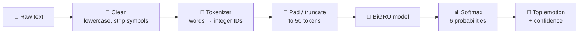
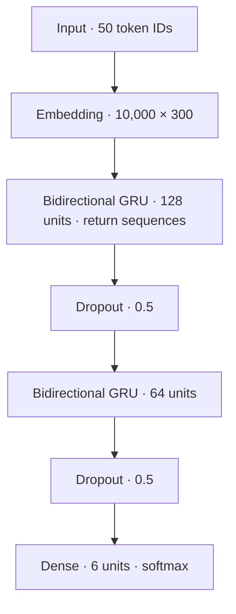

<div align="center">

# 🎭 NLP-sentiment-classification

### Read the emotion hiding in a sentence.

An end-to-end NLP project: a **Bidirectional GRU** trained from scratch on 16,000 labelled sentences, served through a **FastAPI** backend and a clean web UI.

[](https://nlp-sentiment-classification.onrender.com)


**[Live Demo](https://nlp-sentiment-classification.onrender.com)** · **[API Docs](https://nlp-sentiment-classification.onrender.com/docs)** · **[Health Check](https://nlp-sentiment-classification.onrender.com/health)**

</div>

---

## 📖 Table of Contents

- [Overview](#-overview)
- [Live Demo](#-live-demo)
- [Features](#-features)
- [How It Works](#-how-it-works)
- [Dataset](#-dataset)
- [Model Architecture](#-model-architecture)
- [Experiments & Results](#-experiments--results)
- [API Reference](#-api-reference)
- [Project Structure](#-project-structure)
- [Getting Started](#-getting-started)
- [Deployment](#-deployment)
- [Tech Stack](#-tech-stack)

---

## 🌟 Overview

**NLP-sentiment-classification** is a text emotion classifier. You type a sentence, and it tells you which of six emotions the sentence carries, along with how confident it is and the full probability breakdown across all six classes.

| Emotion | Emoji |
|---|:---:|
| Sadness | 😕 |
| Joy | 😊 |
| Love | ❤️ |
| Anger | 😠 |
| Fear | 😨 |
| Surprise | 😮 |

This is more than a notebook. The repo covers the whole lifecycle of an ML project:

1. **Data**: exploring the dataset and handling class imbalance
2. **Modelling**: comparing RNN, LSTM, GRU, BiLSTM and BiGRU architectures
3. **Evaluation**: accuracy, a confusion matrix and per-class metrics
4. **Serving**: a validated, documented REST API with a health check
5. **Deployment**: a public web app anyone can try

---

## 🚀 Live Demo

**👉 https://nlp-sentiment-classification.onrender.com**

Type any sentence, or pick one of the built-in examples, and press **Enter**.

> **Note:** If the app is hosted on a free tier, it may go to sleep when idle. The first request after a quiet period can take up to a minute while the server wakes up and loads the model. The UI shows a *"Connecting to server…"* status while this happens.

---

## ✨ Features

- 🧠 **Deep learning model**: a 2-layer Bidirectional GRU with a 300-dimensional learned embedding
- ⚖️ **Handles class imbalance**: balanced class weights during training, so rare emotions like *surprise* are not ignored
- 📊 **Full probability breakdown**: not just the top label, but the confidence for all six emotions
- 🌐 **Web UI**: a live character counter (max 2,000 characters), one-click example sentences, and a server status indicator
- 🔌 **REST API**: a typed and validated FastAPI backend with auto-generated Swagger docs at `/docs`
- ❤️‍🩺 **Health endpoint**: `/health` reports whether the model has finished loading
- 🔒 **Input validation**: Pydantic enforces 1 to 2,000 characters per request
- ⚡ **Load once, serve many**: the model and tokenizer load a single time at startup using FastAPI's lifespan handler
- 🌍 **CORS enabled**: the API can be called from other front-ends

---

## ⚙️ How It Works



**Inference pipeline** (see `predict_emotion` in the API):

1. **Clean**: lowercase the text, drop apostrophes, replace non-alphanumeric characters with spaces, and collapse extra whitespace.
2. **Tokenize**: convert words to integer IDs using the tokenizer fitted on the training set. Unknown words map to an `<unk>` token.
3. **Pad**: pad or truncate to a fixed length of **50** tokens (`post` padding and truncation).
4. **Predict**: run the BiGRU and take the softmax output.
5. **Respond**: return the top emotion, its confidence and all six probabilities.

---

## 📚 Dataset

The model is trained on the **[dair-ai/emotion](https://huggingface.co/datasets/dair-ai/emotion)** dataset from Hugging Face: short English sentences (Twitter-style) labelled with one of six emotions.

| Split | Samples |
|---|---:|
| Train | 16,000 |
| Test | 2,000 |

- **Classes:** sadness, joy, love, anger, fear, surprise
- **Missing values:** none
- **Vocabulary:** 15,213 unique words in the training set. The model keeps the **10,000** most frequent, and everything else becomes `<unk>`.

### Class imbalance

The training data is clearly imbalanced: *joy* and *sadness* dominate, while *surprise* is the rarest class.

<div align="center">
  
</div>

To stop the model from simply favouring the majority classes, training uses **balanced class weights** computed with `sklearn.utils.class_weight`.

---

## 🏗️ Model Architecture

The final model is a **stacked Bidirectional GRU**.



| Setting | Value |
|---|---|
| Vocabulary size | 10,000 (+ `<unk>` for out-of-vocabulary words) |
| Sequence length | 50 |
| Embedding dimension | 300 |
| Recurrent layers | BiGRU(128) → BiGRU(64) |
| Regularisation | Dropout 0.5 after each recurrent layer |
| Output | Dense(6) with softmax |
| Trainable parameters | ≈ 3.45 M |
| Loss | Sparse categorical cross-entropy |
| Optimizer | Adam |
| Batch size | 32 |
| Max epochs | 20 |
| Early stopping | Monitors `val_loss`, patience 3, restores the best weights |
| Class weights | Balanced |

**Why bidirectional?** Emotion often depends on context from both sides of a word. Reading the sentence forwards and backwards lets the model use the full context around every token.

**Why GRU?** GRUs give LSTM-like sequence modelling with fewer parameters, so they train faster and are lighter to serve.

---

## 🧪 Experiments & Results

Five recurrent architectures were trained under identical conditions (same tokenizer, padding, class weights, optimizer, batch size and early stopping).

| Model | Embedding dim | Test Accuracy |
|---|:---:|---:|
| Simple RNN | 128 | 8.25% |
| LSTM | 128 | 8.05% |
| GRU | 128 | 3.65% |
| Bidirectional LSTM | 300 | 88.55% |
| **Bidirectional GRU** ⭐ | **300** | **92.0%** |

The BiGRU won and is the model deployed in the app.

> **About the unidirectional baselines:** the plain RNN, LSTM and GRU stayed at or below chance level (about 16.7% for six classes) and did not learn a useful signal. A likely cause is that sequences are **post-padded** with no masking. A forward-only recurrent layer must then carry information across many padding steps before its final state is read, while a bidirectional layer has a backward pass that ends on the real first words. Treat this as a plausible explanation rather than a confirmed diagnosis.

### Confusion matrix (BiGRU, 2,000 test samples)

<div align="center">
  
</div>

### Per-class performance

| Emotion | Precision | Recall | F1-score | Test samples |
|---|:---:|:---:|:---:|---:|
| Sadness | 0.987 | 0.935 | 0.960 | 581 |
| Joy | 0.980 | 0.905 | 0.941 | 695 |
| Love | 0.763 | 0.950 | 0.846 | 159 |
| Anger | 0.903 | 0.945 | 0.924 | 275 |
| Fear | 0.872 | 0.879 | 0.876 | 224 |
| Surprise | 0.625 | 0.909 | 0.741 | 66 |
| **Overall** | | | **Accuracy 0.920 · Macro-F1 0.881** | **2,000** |

*Per-class figures are computed from the confusion matrix above.*

### What the errors tell us

- **Joy ↔ Love** is the most common confusion (46 joy sentences were predicted as love). The two emotions share a lot of vocabulary.
- **Fear ↔ Surprise** is the second: 24 fear sentences were predicted as surprise.
- **Surprise** has the lowest precision (0.625). Class weighting pushes the model to predict it more often, which lifts recall (0.909) at some cost to precision.
- **Sadness** and **joy** are the most reliably detected, which is expected given how much training data they have.

### Sample predictions from the notebook

| Sentence | Predicted |
|---|---|
| *"I feel so alone and hopeless today."* | sadness ✅ |
| *"I am furious that they cancelled the trip at the last minute."* | anger ✅ |
| *"I feel terrified when walking down dark alleyways alone."* | fear ✅ |
| *"I was shoked and completely surprised by the unexpected gift!"* | surprise ✅ |
| *"I can't believe how happy I am right now, this is amazing!"* | surprise ⚠️ |

The last row is a good reminder that phrases like *"can't believe"* carry a strong surprise signal, even when the overall sentiment is joyful.

---

## 🔌 API Reference

The interactive Swagger UI is available at **[`/docs`](https://nlp-sentiment-classification.onrender.com/docs)** and ReDoc at **`/redoc`**.

**Base URL:** `https://nlp-sentiment-classification.onrender.com`

| Method | Endpoint | Description |
|---|---|---|
| `GET` | `/` | Serves the web UI |
| `GET` | `/health` | Server and model status |
| `POST` | `/predict` | Predict the emotion of a sentence |

### `GET /health`

```bash
curl https://nlp-sentiment-classification.onrender.com/health
```

```json
{
  "status": "Server is Running...",
  "model_loaded": true
}
```

### `POST /predict`

**Request body**

| Field | Type | Constraints | Description |
|---|---|---|---|
| `text` | string | 1 to 2,000 characters | The sentence to analyse |

**Example request**

```bash
curl -X POST "https://nlp-sentiment-classification.onrender.com/predict" \
  -H "Content-Type: application/json" \
  -d '{"text": "I feel terrified when walking down dark alleyways alone."}'
```

**Example response** *(probability values are illustrative)*

```json
{
  "text": "I feel terrified when walking down dark alleyways alone.",
  "predicted_emotion": "fear",
  "confidence": 0.97,
  "all_probabilities": {
    "sadness": 0.01,
    "joy": 0.00,
    "love": 0.00,
    "anger": 0.01,
    "fear": 0.97,
    "surprise": 0.01
  }
}
```

**Python example**

```python
import requests

url = "https://nlp-sentiment-classification.onrender.com/predict"
response = requests.post(url, json={"text": "I feel so happy and excited"})
result = response.json()

print(result["predicted_emotion"], result["confidence"])
```

**Status codes**

| Code | Meaning |
|:---:|---|
| `200` | Success |
| `422` | Validation error (empty text, or longer than 2,000 characters) |
| `503` | The model is still loading. Retry in a moment |

---

## 📁 Project Structure

```
.
├── Artifacts/
│   ├── BiGRU_Model.keras        # Trained Bidirectional GRU
│   └── tokenizer.pkl            # Tokenizer fitted on the training set
├── static/
│   └── index.html               # Web UI 
├── assets/
│   ├── class_distribution.png   # EDA chart used in this README
│   └── confusion_matrix.png     # Evaluation chart used in this README
├── main.py                      # FastAPI application
├── sentiment_model.ipynb        # Data exploration, training and evaluation
├── requirements.txt             # Python dependencies
└── README.md
```

> Adjust file names above if yours differ (for example, if the API file is called `app.py`).

---

## 🛠️ Getting Started

### Prerequisites

- Python **3.10+**
- `pip`
- TensorFlow with **Keras 3** (TensorFlow 2.16 or newer), since the model is saved in the `.keras` format

### 1. Clone the repository

```bash
git clone https://github.com/<your-username>/<your-repo>.git
cd <your-repo>
```

### 2. Create a virtual environment

```bash
python -m venv venv

# macOS / Linux
source venv/bin/activate

# Windows
venv\Scripts\activate
```

### 3. Install dependencies

```bash
pip install fastapi "uvicorn[standard]" tensorflow numpy pydantic
```

Or, if you keep a `requirements.txt`:

```bash
pip install -r requirements.txt
```

### 4. Run the server

```bash
uvicorn main:app --reload
```

Then open:

| URL | What you get |
|---|---|
| http://127.0.0.1:8000 | The web UI |
| http://127.0.0.1:8000/docs | Interactive API docs |
| http://127.0.0.1:8000/health | Health check |

### Retraining the model (optional)

Open `sentiment_model.ipynb` in Jupyter, Colab or VS Code and run all cells. The final cell writes the model and tokenizer to the `Artifacts/` folder, which the API reads at startup.

Extra dependencies for the notebook:

```bash
pip install datasets scikit-learn pandas seaborn matplotlib
```

---

## ☁️ Deployment

The app is deployed on **[Render](https://render.com)** as a web service. A typical configuration:

| Setting | Value |
|---|---|
| Environment | Python 3 |
| Build command | `pip install -r requirements.txt` |
| Start command | `uvicorn main:app --host 0.0.0.0 --port $PORT` |

Make sure the `Artifacts/` and `static/` folders are committed to the repository, because the app loads the model, tokenizer and UI from these paths at startup.

---

## 🧰 Tech Stack

| Layer | Tools |
|---|---|
| **Modelling** | TensorFlow / Keras, scikit-learn |
| **Data & EDA** | Hugging Face `datasets`, pandas, NumPy, seaborn, matplotlib |
| **Backend** | FastAPI, Uvicorn, Pydantic |
| **Frontend** | HTML, CSS and vanilla JavaScript, served as static files |
| **Hosting** | Render |

---
